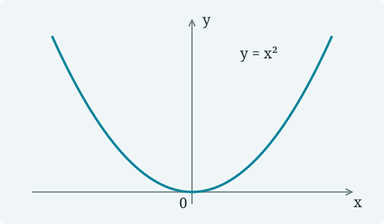
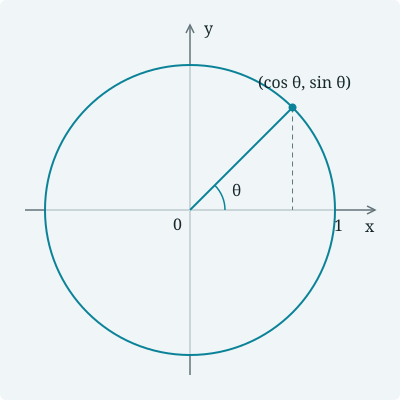

This page pairs copyable source with rendered examples. 本页可以直接作为数学笔记模板：复制需要的段落，然后替换内容即可。

This demo lives in content-demo/. Run npm run dev:demo in the framework repository to preview it with site.demo.config.mjs. Installed sites use their own site.config.mjs and content directories. Framework instructions are in README.md.

For editor-side authoring, Markdown Math Preview adds custom syntax and offline MathJax to VS Code's built-in preview. The website framework and extension share the renderer in this repository. Its SYNTAX.md defines their common syntax. Use Ctrl+K V for native scroll synchronization and double-click source navigation. Multiline formulas map to source blocks. Use npm run dev:demo to inspect website layout, PDF embedding, and encrypted articles. See README.md for setup.

## Metadata and organization

Put notes anywhere inside content/ by default. Set contentDirs in site.config.mjs to a path string or a nonempty array to use other directories:

```js
export default {
  // Merge this field into your existing site configuration.
  contentDirs: ['content', '../shared-notes']
};
```

Paths are relative to the project root; absolute paths also work. All configured directories must exist. Their notes share one list, pagination, and search index. Repeated or overlapping directories include each file once; different notes must have unique slugs. Attachments with the same relative name in different directories stay separate. Live preview watches every configured directory. Missing slugs are saved back to the original Markdown files, including files outside the project.

A YAML front matter block with a nonempty title is required; other fields are optional:

```yaml
---
title: demo
date: 2026-09-21
tags: [Analysis, 数学分析]
slug: "a1b2c3d4e5f6"
lang: en
draft: false
---
```

| Field | Purpose |
| --- | --- |
| title | Required, nonempty page title. |
| date | YYYY-MM-DD; optional, used for ordering. |
| tags | A list of tags, including Chinese or English text. |
| slug | Persistent 12-character lowercase hexadecimal identity; generated and saved when omitted. |
| lang | en, zh, zh-CN, or zh-TW; sets the article language. |
| draft | true excludes a note from production builds; dev preview still includes it. |
| password | Optional password for this article; use a nonempty quoted string. |
| pdf | Optional PDF path, relative to this Markdown file. |

Use lang: zh-CN to mark a Chinese article. Without lang, the language is inferred from the title and body. Environment labels such as Theorem, Proof, and Remark always stay in English; custom titles and content may be Chinese, English, or both.

Both npm run dev and npm run dev:demo include drafts in navigation, pagination, tags, and search, with images and PDF attachments available for preview. Draft edits reload automatically. A Draft badge distinguishes drafts in lists, search results, and previous/next links; draft articles also show “Unpublished · local preview only” above the title. npm run build excludes drafts from the exported pages, search index, and sitemap, and does not automatically publish their attachments.

```text
content/
  demo/
    demo.md
    figures/parabola.svg
    assets/unit-circle.svg
  lecture/
    lecture.md
    lecture.pdf
```

Folders organize source files only; they do not define article URLs or tags. A folder named after its Markdown file is convenient, but any nesting is allowed. Files without front matter and standalone PDFs do not become articles; invalid front matter stops the build with the filename in the error.

On the first successful build or preview, a missing slug is generated and written into the Markdown header. URLs use the language and slug, such as /en/a1b2c3d4e5f6/ or /zh/a1b2c3d4e5f6/. All Chinese language variants use the /zh/ prefix. Keep both lang and slug when editing, renaming, or moving a note, and commit them with the source. Set lang explicitly to keep mixed-language edits from changing the inferred URL prefix. When copying a note to start a new article, remove the copied slug to get a new identity. Duplicate slugs are rejected. The sample slug above is illustrative; omit it for new articles.

Relative image, attachment, PDF, and Markdown links start at the Markdown file's directory. Both Markdown images and HTML img tags follow this rule. You can use ../ for shared resources, including links across configured directories; referenced files must exist inside a configured content directory. Move a note and its local resources together to keep their relative links intact; update links to other folders when their relative locations change.

## Markdown basics

### Encrypted articles

To encrypt a whole article, give it its own password in YAML front matter:

```yaml
title: Private notes
password: "replace-with-this-article-password"
```

Each article can have a different password. Run npm run dev or npm run build as usual; editing the article's password triggers a dev rebuild. This guide remains public; the block above is only a source example.

Try the [encrypted example](linear-algebra/spectral-theorem.md) with the password `math-notes-demo`. Its source and password are public for demonstration purposes.

Titles, dates, tags, and URLs stay public, with an Encrypted badge. The body, contents, formulas, and relative local images and attachments are encrypted together. PDF wrappers also encrypt their PDFs. Search excludes the protected body and PDF text. Unlocking restores reading, copying, and navigation; refreshing locks the page again. Both dev and production require the password, HTTPS or localhost, and JavaScript.

Keep plaintext source files and original attachments out of public repositories. Shared public/private attachments cause a build error; external URLs and manually published resources remain public. See README.md for password setup and the encryption boundaries.

### Text and inline notation

```markdown
**Bold**, *emphasis*, ~~deleted text~~, and `inline code`.

中英文混排：a sequence $a_n$ 收敛到 $a$，记作 $a_n\to a$。

Write a literal price as \$5; put LaTeX source in code, such as `\frac{a}{b}`.
```

**Bold**, *emphasis*, ~~deleted text~~, and `inline code`.

中英文混排：a sequence $a_n$ 收敛到 $a$，记作 $a_n\to a$。

Write a literal price as \$5; put LaTeX source in code, such as `\frac{a}{b}`.

Literal escaped delimiters remain text: \\(x\\) and \\[x\\]. Write them as `\\(x\\)` and `\\[x\\]` in the source.

### Highlighter annotations

Use `text` for yellow; replace `yellow` with `green` or `pink` for other colors. Highlights wrap with the text, like a PDF highlighter, and keep dark text on a bright background in either theme. Keep each pair within one paragraph; markers can be inline or on their own lines without blank lines. Code stays literal. Escape the opening brace to display a marker as ordinary text. Unmatched markers and unsupported colors report build errors.

```markdown
A useful estimate states its assumptions clearly and explains which constants depend on the data, so the conclusion remains meaningful when the parameters change. The proof combines **compactness** with a local estimate to control the error across the entire domain, including points close to the boundary. The conclusion may fail without uniform control of the remainder, even if every individual approximation converges.

For $x > 0$, **positivity** is preserved; see the [example](https://example.com).
```

A useful estimate states its assumptions clearly and explains which constants depend on the data, so the conclusion remains meaningful when the parameters change. The proof combines **compactness** with a local estimate to control the error across the entire domain, including points close to the boundary. The conclusion may fail without uniform control of the remainder, even if every individual approximation converges.

For $x > 0$, **positivity** is preserved; see the [example](https://example.com).

### Lists and quotations

```markdown
1. State the assumptions.
2. Derive the estimate.
3. Check the conclusion.

- Definitions and notation
- Examples
    - A finite-dimensional example
    - An infinite-dimensional example

> 先明确假设，再讨论结论。
>
> A useful estimate explains which constants depend on the data.
```

1. State the assumptions.
2. Derive the estimate.
3. Check the conclusion.

- Definitions and notation
- Examples
    - A finite-dimensional example
    - An infinite-dimensional example

> 先明确假设，再讨论结论。
>
> A useful estimate explains which constants depend on the data.

### Tables and footnotes

```markdown
| Symbol | Meaning / 含义 | Example |
| :--- | :--- | ---: |
| $x\in\mathbb{R}^n$ | A vector / 向量 | $n=3$ |
| $\lVert x\rVert_2$ | Euclidean norm / 欧氏范数 | $\sqrt{14}$ |
| $\langle x,y\rangle$ | Inner product / 内积 | $0$ |

Tables are centered and scroll within narrow screens. A footnote can hold a short aside.[^notation]
```

| Symbol | Meaning / 含义 | Example |
| :--- | :--- | ---: |
| $x\in\mathbb{R}^n$ | A vector / 向量 | $n=3$ |
| $\lVert x\rVert_2$ | Euclidean norm / 欧氏范数 | $\sqrt{14}$ |
| $\langle x,y\rangle$ | Inner product / 内积 | $0$ |

Tables are centered and scroll within narrow screens. A footnote can hold a short aside.[^notation]

Define a footnote elsewhere in the same file:

```markdown
[^notation]: Here the inner product is the standard Euclidean one.
```

## Code blocks

Fenced code preserves dollar signs, LaTeX, and statement markers. Add a language after the opening fence for syntax highlighting, a language label, and a Copy button. Code blocks have a cool blue gradient background and no line numbers. Copy includes the original code and indentation. Long lines scroll inside the block; colors follow the current theme.

### Fence syntax

Copy this complete Markdown example, including the three backticks on each end:

````markdown
```python
def squared_norm(values):
    return sum(value * value for value in values)

print(squared_norm([1, 2, 3]))
```
````

### Rendered example

```python
def squared_norm(values):
    return sum(value * value for value in values)

print(squared_norm([1, 2, 3]))
```

```latex
$not_rendered_as_math$
\begin{align}
a &= b+c
\end{align}

This stays literal inside a code fence.

```

### More code languages

Common labels include python, js, ts, cpp, c, matlab, julia, bash, json, yaml, html, css, and latex. An omitted or unknown language displays plain text. Highlighting is generated during the build, so it works without browser JavaScript; Copy needs JavaScript and HTTPS or localhost.

```cpp
#include <numeric>
#include <vector>

int main() {
    const std::vector<double> x{1.0, 2.0, 3.0};
    const double norm2 = std::inner_product(x.begin(), x.end(), x.begin(), 0.0);
    return norm2 == 14.0 ? 0 : 1;
}
```

```matlab
% Symmetric eigenvalue problem
A = [2, 1; 1, 2];
[V, D] = eig(A);
residual = norm(A * V - V * D);
disp(residual);
```

```js
const square = x => x * x;
const total = [1, 2, 3].map(square).reduce((a, b) => a + b, 0);
console.log(total);
```

```bash
npm run dev
npm run build
```

```json
{
  "title": "demo",
  "tags": ["数学", "Notes"],
  "published": true
}
```

Headings create the Contents navigation automatically. Use ## for sections and ### for subsections; the page title comes from front matter.

## Math delimiters

### Inline and display math

```markdown
Inline forms: $e^{i\pi}+1=0$ and \(\nabla\cdot\mathbf{u}=0\).

$$
\int_0^1 x^2\,\mathrm{d}x=\frac13.
$$

\[
\sum_{k=0}^{\infty}\frac{z^k}{k!}=e^z.
\]
```

Inline forms: $e^{i\pi}+1=0$ and \(\nabla\cdot\mathbf{u}=0\).

$$
\int_0^1 x^2\,\mathrm{d}x=\frac13.
$$

\[
\sum_{k=0}^{\infty}\frac{z^k}{k!}=e^z.
\]

Put display delimiters on their own lines, or write a whole display on one line. Move text following a closing delimiter to a new line.

## Numbering and references

```latex
A reference can appear before its equation: see $\eqref{eq:demo-energy}$.

\begin{equation}
E=mc^2. \label{eq:demo-energy}
\end{equation}

Equation $\eqref{eq:demo-energy}$ is numbered automatically.

\begin{equation}
a^2+b^2=c^2. \tag{P} \label{eq:demo-pythagoras}
\end{equation}

A custom tag works too: $\eqref{eq:demo-pythagoras}$.
```

A reference can appear before its equation: see $\eqref{eq:demo-energy}$.

\begin{equation}
E=mc^2. \label{eq:demo-energy}
\end{equation}

Equation $\eqref{eq:demo-energy}$ is numbered automatically.

\begin{equation}
a^2+b^2=c^2. \tag{P} \label{eq:demo-pythagoras}
\end{equation}

A custom tag works too: $\eqref{eq:demo-pythagoras}$.

Numbering restarts in each note. Use a unique label within that note. Numbered environments can be written directly, without surrounding dollar signs. Starred environments suppress automatic numbering.

## Multiline formulas

### align and align*

```latex
\begin{align}
\lVert u+v\rVert^2
  &=\langle u+v,u+v\rangle \notag\\
  &=\lVert u\rVert^2+2\langle u,v\rangle+\lVert v\rVert^2.
  \label{eq:demo-sum}
\end{align}

\begin{align*}
(a+b)^2 &= a^2+2ab+b^2,\\
(a-b)^2 &= a^2-2ab+b^2.
\end{align*}
```

\begin{align}
\lVert u+v\rVert^2
  &=\langle u+v,u+v\rangle \notag\\
  &=\lVert u\rVert^2+2\langle u,v\rangle+\lVert v\rVert^2.
  \label{eq:demo-sum}
\end{align}

\begin{align*}
(a+b)^2 &= a^2+2ab+b^2,\\
(a-b)^2 &= a^2-2ab+b^2.
\end{align*}

Use & for alignment and \\ for a line break. The command \notag suppresses one line number; see $\eqref{eq:demo-sum}$.

### aligned and split

Nest a derivation inside equation to give the whole block one number.

```latex
\begin{equation}
\begin{aligned}
I &=\int_0^1 xe^x\,\mathrm{d}x\\
  &=\left[xe^x\right]_0^1-\int_0^1 e^x\,\mathrm{d}x\\
  &=e-(e-1)=1.
\end{aligned}
\end{equation}

\begin{equation}
\begin{split}
(a+b+c)^2
  &=a^2+b^2+c^2\\
  &\quad+2ab+2ac+2bc.
\end{split}
\end{equation}
```

\begin{equation}
\begin{aligned}
I &=\int_0^1 xe^x\,\mathrm{d}x\\
  &=\left[xe^x\right]_0^1-\int_0^1 e^x\,\mathrm{d}x\\
  &=e-(e-1)=1.
\end{aligned}
\end{equation}

\begin{equation}
\begin{split}
(a+b+c)^2
  &=a^2+b^2+c^2\\
  &\quad+2ab+2ac+2bc.
\end{split}
\end{equation}

### gather and multline

gather centers independent lines; multline breaks one long expression across lines.

```latex
\begin{gather}
\sin^2\theta+\cos^2\theta=1,\\
\cos(2\theta)=\cos^2\theta-\sin^2\theta.
\end{gather}

\begin{multline}
(a+b)^4=a^4+4a^3b+6a^2b^2\\
+4ab^3+b^4.
\end{multline}
```

\begin{gather}
\sin^2\theta+\cos^2\theta=1,\\
\cos(2\theta)=\cos^2\theta-\sin^2\theta.
\end{gather}

\begin{multline}
(a+b)^4=a^4+4a^3b+6a^2b^2\\
+4ab^3+b^4.
\end{multline}

### alignat and alignedat

alignat controls the spacing between alignment pairs. alignedat is useful inside a larger display.

```latex
\begin{alignat}{2}
x+y &= 3, &\qquad x-y &= 1,\\
u+v &= 7, &\qquad u-v &= 3.
\end{alignat}

\[
\begin{alignedat}{2}
x &= 2, &\qquad y &= 1,\\
u &= 5, &\qquad v &= 2.
\end{alignedat}
\]
```

\begin{alignat}{2}
x+y &= 3, &\qquad x-y &= 1,\\
u+v &= 7, &\qquad u-v &= 3.
\end{alignat}

\[
\begin{alignedat}{2}
x &= 2, &\qquad y &= 1,\\
u &= 5, &\qquad v &= 2.
\end{alignedat}
\]

## Matrices, arrays, and cases

### Matrices and determinants

```latex
\[
A=\begin{pmatrix}1&2\\3&4\end{pmatrix},
\qquad
I=\begin{bmatrix}1&0\\0&1\end{bmatrix},
\qquad
\det A=\begin{vmatrix}1&2\\3&4\end{vmatrix}=-2.
\]

\[
B=\begin{bmatrix}
\begin{matrix}1&0\\0&1\end{matrix} & \mathbf{0}\\
\mathbf{0} & \begin{matrix}2&0\\0&2\end{matrix}
\end{bmatrix}.
\]

\[
\left[\begin{array}{cc|c}
1&2&3\\
0&1&4
\end{array}\right].
\]
```

\[
A=\begin{pmatrix}1&2\\3&4\end{pmatrix},
\qquad
I=\begin{bmatrix}1&0\\0&1\end{bmatrix},
\qquad
\det A=\begin{vmatrix}1&2\\3&4\end{vmatrix}=-2.
\]

\[
B=\begin{bmatrix}
\begin{matrix}1&0\\0&1\end{matrix} & \mathbf{0}\\
\mathbf{0} & \begin{matrix}2&0\\0&2\end{matrix}
\end{bmatrix}.
\]

\[
\left[\begin{array}{cc|c}
1&2&3\\
0&1&4
\end{array}\right].
\]

### Piecewise definitions

cases and mathtools dcases support piecewise formulas; dcases uses display-size fractions.

```latex
\[
f(x)=\begin{cases}
\dfrac{\sin x}{x}, & x\ne0,\\
1, & x=0.
\end{cases}
\qquad
F(x)=\begin{dcases}
\int_0^x t\,\mathrm{d}t, & x\ge0,\\
0, & x<0.
\end{dcases}
\]
```

\[
f(x)=\begin{cases}
\dfrac{\sin x}{x}, & x\ne0,\\
1, & x=0.
\end{cases}
\qquad
F(x)=\begin{dcases}
\int_0^x t\,\mathrm{d}t, & x\ge0,\\
0, & x<0.
\end{dcases}
\]

## More mathematical notation

```latex
\[
\mathcal{F}[f](\xi)
  =\int_{\mathbb{R}}f(x)e^{-2\pi i x\xi}\,\mathrm{d}x,
\qquad
\operatorname{supp}f\subseteq[-1,1].
\]

\[
\underbrace{1+\cdots+1}_{n\text{ terms}}=n,
\qquad
\overbrace{x_1+\cdots+x_n}^{S_n},
\qquad
\lim_{n\to\infty}\frac1n\sum_{k=1}^n\frac{k}{n}=\frac12.
\]

\[
\boldsymbol{\alpha}\in\mathbb{R}^n,
\qquad
\lVert x\rVert_2=\sqrt{\sum_{j=1}^n|x_j|^2},
\qquad
A\xrightarrow{\text{row operations}}R.
\]
```

\[
\mathcal{F}[f](\xi)
  =\int_{\mathbb{R}}f(x)e^{-2\pi i x\xi}\,\mathrm{d}x,
\qquad
\operatorname{supp}f\subseteq[-1,1].
\]

\[
\underbrace{1+\cdots+1}_{n\text{ terms}}=n,
\qquad
\overbrace{x_1+\cdots+x_n}^{S_n},
\qquad
\lim_{n\to\infty}\frac1n\sum_{k=1}^n\frac{k}{n}=\frac12.
\]

\[
\boldsymbol{\alpha}\in\mathbb{R}^n,
\qquad
\lVert x\rVert_2=\sqrt{\sum_{j=1}^n|x_j|^2},
\qquad
A\xrightarrow{\text{row operations}}R.
\]

### mathtools and physics

These packages are already enabled; no macro setup is needed.

```latex
\[
g(x)\coloneqq x^2,
\qquad
\dv{g}{x}=2x,
\qquad
\pdv{f}{x}=y\quad\text{for }f(x,y)=xy.
\]

\[
\qty(\frac{a+b}{c})^2,
\qquad
\bra{\psi}\hat{H}\ket{\psi},
\qquad
\begin{gathered}
a_n\to a\\
b_n\to b
\end{gathered}
\quad\Longrightarrow\quad a_n+b_n\to a+b.
\]

\[
\begin{multlined}
(a+b+c)^2=a^2+b^2+c^2\\
+2ab+2ac+2bc.
\end{multlined}
\]
```

\[
g(x)\coloneqq x^2,
\qquad
\dv{g}{x}=2x,
\qquad
\pdv{f}{x}=y\quad\text{for }f(x,y)=xy.
\]

\[
\qty(\frac{a+b}{c})^2,
\qquad
\bra{\psi}\hat{H}\ket{\psi},
\qquad
\begin{gathered}
a_n\to a\\
b_n\to b
\end{gathered}
\quad\Longrightarrow\quad a_n+b_n\to a+b.
\]

\[
\begin{multlined}
(a+b+c)^2=a^2+b^2+c^2\\
+2ab+2ac+2bc.
\end{multlined}
\]

### A wide formula

On a narrow screen, this formula scrolls inside its own block. The article stays within the screen width.

```latex
\[
\begin{bmatrix}
a_{11}&a_{12}&a_{13}&a_{14}&a_{15}&a_{16}&a_{17}&a_{18}\\
a_{21}&a_{22}&a_{23}&a_{24}&a_{25}&a_{26}&a_{27}&a_{28}\\
a_{31}&a_{32}&a_{33}&a_{34}&a_{35}&a_{36}&a_{37}&a_{38}
\end{bmatrix}
\begin{bmatrix}x_1\\x_2\\x_3\\x_4\\x_5\\x_6\\x_7\\x_8\end{bmatrix}
=\begin{bmatrix}b_1\\b_2\\b_3\end{bmatrix}.
\]
```

\[
\begin{bmatrix}
a_{11}&a_{12}&a_{13}&a_{14}&a_{15}&a_{16}&a_{17}&a_{18}\\
a_{21}&a_{22}&a_{23}&a_{24}&a_{25}&a_{26}&a_{27}&a_{28}\\
a_{31}&a_{32}&a_{33}&a_{34}&a_{35}&a_{36}&a_{37}&a_{38}
\end{bmatrix}
\begin{bmatrix}x_1\\x_2\\x_3\\x_4\\x_5\\x_6\\x_7\\x_8\end{bmatrix}
=\begin{bmatrix}b_1\\b_2\\b_3\end{bmatrix}.
\]

MathJax handles mathematical notation, rather than complete LaTeX documents. Use a PDF for a document that requires arbitrary packages or TikZ. Unsupported commands and unclosed formula blocks produce a build error naming the source file.

## Definitions, theorems, and proofs

Colors distinguish the environments: theorem and proposition are purple; lemma and corollary blue; definition green; example, remark, and note ochre; problem rose; proof gray-blue; and solution teal. Custom titles appear in parentheses, as in Example (Title). Proof, solution, remark, and note share the Markdown blockquote style: a 3px left rule, 20px horizontal and 8px vertical padding, and 22px vertical margins, without a box or background. Their colored titles run into the first paragraph; ordinary blockquotes have no label. Lists, code blocks, and display equations retain their block layout. Boxed environments use uniform 2px borders. Both light and dark themes use the same color families.

Every environment uses a begin/end pair on separate lines. The title after begin is optional. Both Chinese and English content work inside a block.

### Definition

```markdown

For $x\in\mathbb{R}^n$, define
\[
\lVert x\rVert_2=\left(\sum_{j=1}^n x_j^2\right)^{1/2}.
\]

```


For $x\in\mathbb{R}^n$, define
\[
\lVert x\rVert_2=\left(\sum_{j=1}^n x_j^2\right)^{1/2}.
\]


### Lemma

```markdown

For every real number $t$, $t^2\ge0$, with equality exactly when $t=0$.

```


For every real number $t$, $t^2\ge0$, with equality exactly when $t=0$.


### Proposition

```markdown

For $a,b\in\mathbb{R}$,
\[
2ab\le a^2+b^2.
\]
Equality holds if and only if $a=b$.

```


For $a,b\in\mathbb{R}$,
\[
2ab\le a^2+b^2.
\]
Equality holds if and only if $a=b$.


### Theorem and proof

```markdown

For $x,y\in\mathbb{R}^n$,
\[
|\langle x,y\rangle|\le\lVert x\rVert_2\lVert y\rVert_2.
\]



If $y=0$, the statement is immediate. Otherwise set
$t=\langle x,y\rangle/\lVert y\rVert_2^2$. Then
\begin{align*}
0&\le\lVert x-ty\rVert_2^2\\
 &=\lVert x\rVert_2^2-\frac{\langle x,y\rangle^2}{\lVert y\rVert_2^2}.
\end{align*}
Multiply by $\lVert y\rVert_2^2$ and take square roots.


等号成立当且仅当 $x,y$ 线性相关。This includes the case where either vector is zero.


```


For $x,y\in\mathbb{R}^n$,
\[
|\langle x,y\rangle|\le\lVert x\rVert_2\lVert y\rVert_2.
\]



If $y=0$, the statement is immediate. Otherwise set
$t=\langle x,y\rangle/\lVert y\rVert_2^2$. Then
\begin{align*}
0&\le\lVert x-ty\rVert_2^2\\
 &=\lVert x\rVert_2^2-\frac{\langle x,y\rangle^2}{\lVert y\rVert_2^2}.
\end{align*}
Multiply by $\lVert y\rVert_2^2$ and take square roots.


等号成立当且仅当 $x,y$ 线性相关。This includes the case where either vector is zero.



### Remark without a title

```markdown

A remark can include ordinary Markdown:

- **Assumption:** vectors are real in the proof above.
- **Extension:** over the complex numbers, use the Hermitian inner product.

标记只控制样式；定理标题与正文由作者填写。

```


A remark can include ordinary Markdown:

- **Assumption:** vectors are real in the proof above.
- **Extension:** over the complex numbers, use the Hermitian inner product.

标记只控制样式；定理标题与正文由作者填写。


### Solution

```markdown

Solve $x^2-3x+2=0$. Factoring gives $(x-1)(x-2)=0$, so $x=1$ or $x=2$.

```


Solve $x^2-3x+2=0$. Factoring gives $(x-1)(x-2)=0$, so $x=1$ or $x=2$.


### Example

```markdown

The function $f(x)=|x|$ is continuous everywhere but is not differentiable at $x=0$.

```


The function $f(x)=|x|$ is continuous everywhere but is not differentiable at $x=0$.


### Problem with a solution

```markdown

Find $S_n=1+2+\cdots+n$ for a positive integer $n$.


Pair terms from opposite ends to obtain $2S_n=n(n+1)$, so $S_n=n(n+1)/2$.


```


Find $S_n=1+2+\cdots+n$ for a positive integer $n$.


Pair terms from opposite ends to obtain $2S_n=n(n+1)$, so $S_n=n(n+1)/2$.



### Corollary

```markdown

Setting $y=(1,\ldots,1)$ gives
\[
\left(\sum_{i=1}^n x_i\right)^2 \le n\sum_{i=1}^n x_i^2.
\]

```


Setting $y=(1,\ldots,1)$ gives
\[
\left(\sum_{i=1}^n x_i\right)^2 \le n\sum_{i=1}^n x_i^2.
\]


### Note

```markdown

A note adds reading advice or background without a filled box. The label remains English even when the title and content are Chinese.

```


A note adds reading advice or background without a filled box. The label remains English even when the title and content are Chinese.


The supported names are definition, lemma, proposition, corollary, theorem, example, problem, proof, solution, remark, and note. Blocks may be nested, as in the proof and problem above. Always close them in reverse order; do not use colon-style block markers.

### Statement markers inside list code blocks

A fence may start on the same line as a list marker. Statement markers inside the fence stay literal, including a marker that matches the surrounding block:

````markdown

- ```markdown
  
  ```

This paragraph is still inside the theorem.

````


- ```markdown
  
  ```

This paragraph is still inside the theorem.


## Local figures

### Markdown image

The following file is in figures/ next to this note:

```markdown

```


### HTML image

Use an img tag to specify a width. This example uses the local assets/ folder:

```html

```


Images are centered and shrink proportionally on narrow screens. HTML images accept src, alt, title, width, height, and loading. Width and height are positive pixel values. Other raw HTML is displayed as text. Code examples do not copy or load their referenced images.

## Links and attachments

```markdown
- [一致收敛 / Uniform convergence](analysis/uniform-convergence.md)
- [The spectral theorem](linear-algebra/spectral-theorem.md)
- [Back to Markdown basics](#markdown-basics)
- [Open the sample PDF](numerical-analysis/trapezoidal-rule.pdf)
- [Homepage](https://example.com)
```

- [一致收敛 / Uniform convergence](analysis/uniform-convergence.md)
- [The spectral theorem](linear-algebra/spectral-theorem.md)
- [Back to Markdown basics](#markdown-basics)
- [Open the sample PDF](numerical-analysis/trapezoidal-rule.pdf)
- [Homepage](https://example.com)

The build rewrites links to Markdown notes and copies referenced attachments. Missing files or links to unpublished notes cause a build error. Anchor links use the heading text in lowercase, with spaces replaced by hyphens. Duplicate IDs receive an unused numeric suffix: headings Foo, Foo, and Foo-2 produce foo, foo-2, and foo-2-2.

## PDF notes

A PDF is published through a Markdown wrapper with a title and a relative pdf path. Add tags, a date, and reading notes as needed:

```markdown
---
title: demo
date: 2026-09-21
tags: [Numerical analysis, PDF]
pdf: ./lecture.pdf
lang: en
---

## Reading notes

This document contains the full derivation and worked examples.
```

The PDF path is relative to the wrapper. A referenced PDF does not create a second article. Its preview fits the available width, supports text selection, and provides Open PDF and Download links.

`npm run build` publishes existing PDFs without requiring LaTeX, even when a same-name source such as lecture.tex is present. Missing PDFs fail the build and preserve the previous publication. This command does not check whether the PDF matches the latest LaTeX source.

After editing LaTeX, run `npm run build:latex` locally to compile referenced sources with latexmk before reading or publishing their PDFs, including PDF download links and encrypted attachments. Install a LaTeX distribution with latexmk, and make the command available on PATH. A missing command or failed compilation stops this build and preserves the previous publication, even if an older PDF exists. Unreferenced sources are not compiled; production builds also skip draft-only attachments. Use `npm run build:latex -- --config site.demo.config.mjs` for this demo.

Preview still compiles LaTeX automatically and reuses a successful PDF while its source, recorded dependencies, and output remain unchanged. The dependency cache lives in .aux/ and survives preview restarts, so editing Markdown or site styles does not launch the compiler again. Missing or changed dependencies, a missing or changed PDF, or an unavailable cache triggers compilation. Failed compilation invalidates the cache. The build:latex command always invokes the compiler and refreshes the preview cache.

Commit the PDF beside its LaTeX source, together with the source and its inputs. PDFs in content directories are tracked by Git; public/ contains only generated publication copies and remains ignored, as do .aux/ and SyncTeX files. The framework defaults to XeLaTeX; a first-line `% !TEX program = ...` or `% !TEX TS-program = ...` directive selects xelatex, pdflatex, or lualatex. Use pdflatex for English and xelatex for Chinese unless the document requires another engine. PDF-only attachments still work without LaTeX. Preview watches source changes and ignores generated PDFs and auxiliary files to avoid rebuild loops.

Try the [PDF example with metadata and a two-page document](numerical-analysis/trapezoidal-rule.md). The PDF contains selectable text, numbered equations, a theorem, a proof, and a table. PDF contents are not converted into Markdown; the Contents navigation comes from the wrapper's headings.

Compilation runs `latexmk` from the source directory with `.aux/` for auxiliary files and the PDF beside the `.tex` file. `latexmk` decides whether an unchanged document needs typesetting. Ordinary builds publish existing PDFs without changing them.

## BibTeX citations

Keep bibliographic records inside the article, using the same begin/end style as theorem environments. The block may appear before or after the citations, and multiple blocks are allowed. No separate bibliography file is needed.

These three real papers demonstrate DOI links, a publisher page, and an original PDF. Their publication details can be checked at [NIST](https://www.nist.gov/nist-research-library/journal-research-volume-49), [Wiley](https://onlinelibrary.wiley.com/doi/10.1002/j.1538-7305.1948.tb01338.x), and [PNAS](https://www.pnas.org/doi/10.1073/pnas.36.1.48):

```bibtex

@article{hestenes1952,
  author = {Hestenes, Magnus R. and Stiefel, Eduard},
  title = {Methods of Conjugate Gradients for Solving Linear Systems},
  journal = {Journal of Research of the National Bureau of Standards},
  year = {1952},
  volume = {49},
  number = {6},
  pages = {409--436},
  doi = {10.6028/jres.049.044},
  url = {https://nvlpubs.nist.gov/nistpubs/jres/049/jresv49n6p409_A1b.pdf}
}

@article{shannon1948,
  author = {Shannon, Claude E.},
  title = {A Mathematical Theory of Communication},
  journal = {The Bell System Technical Journal},
  year = {1948},
  volume = {27},
  number = {3},
  pages = {379--423},
  doi = {10.1002/j.1538-7305.1948.tb01338.x},
  url = {https://onlinelibrary.wiley.com/doi/10.1002/j.1538-7305.1948.tb01338.x}
}

@article{nash1950,
  author = {Nash, Jr., John F.},
  title = {Equilibrium Points in n-Person Games},
  journal = {Proceedings of the National Academy of Sciences},
  year = {1950},
  volume = {36},
  number = {1},
  pages = {48--49},
  doi = {10.1073/pnas.36.1.48}
}

```


@article{hestenes1952,
  author = {Hestenes, Magnus R. and Stiefel, Eduard},
  title = {Methods of Conjugate Gradients for Solving Linear Systems},
  journal = {Journal of Research of the National Bureau of Standards},
  year = {1952},
  volume = {49},
  number = {6},
  pages = {409--436},
  doi = {10.6028/jres.049.044},
  url = {https://nvlpubs.nist.gov/nistpubs/jres/049/jresv49n6p409_A1b.pdf}
}

@article{shannon1948,
  author = {Shannon, Claude E.},
  title = {A Mathematical Theory of Communication},
  journal = {The Bell System Technical Journal},
  year = {1948},
  volume = {27},
  number = {3},
  pages = {379--423},
  doi = {10.1002/j.1538-7305.1948.tb01338.x},
  url = {https://onlinelibrary.wiley.com/doi/10.1002/j.1538-7305.1948.tb01338.x}
}

@article{nash1950,
  author = {Nash, Jr., John F.},
  title = {Equilibrium Points in n-Person Games},
  journal = {Proceedings of the National Academy of Sciences},
  year = {1950},
  volume = {36},
  number = {1},
  pages = {48--49},
  doi = {10.1073/pnas.36.1.48}
}


Use citation keys in square brackets:

```markdown
A single citation: [@hestenes1952].

A repeated citation with a locator: [@hestenes1952, pp. 409–410].

Several references together: [@hestenes1952; @shannon1948; @nash1950].

A citation can also appear inside a footnote.[^bib-example]
```

A single citation: [@hestenes1952].

A repeated citation with a locator: [@hestenes1952, pp. 409–410].

Several references together: [@hestenes1952; @shannon1948; @nash1950].

A citation can also appear inside a footnote.[^bib-example]

The raw BibTeX block is hidden in the rendered article. Only cited entries appear in References at the end, using numeric citations and Vancouver bibliography formatting. Numbers follow first appearance in the rendered text, and repeated citations reuse the same number. References includes return links to each citation and appears in Contents.

Use a comma after the key for a page, section, or theorem locator, and a semicolon to separate references. Keys are case-sensitive. Code examples and formulas keep citation syntax literal. Duplicate keys, missing references, malformed BibTeX, and unclosed blocks stop the build with an error identifying the note.

Common book, article, and conference records are supported, including authors, editors, year, title, publication details, DOI, URL, Unicode names, and common TeX accents. A valid doi field produces a DOI link; a valid HTTP(S) url field produces an Article or PDF link. Duplicate DOI links are merged. Every entry with a title also gets a Google Scholar link that searches that title, even when no DOI or URL is supplied. References and links are generated locally at build time and remain usable without JavaScript.

## Search and reading

- The header shows the Markdown word count: Chinese characters and English words, excluding code, formulas, images, and bibliography entries. PDF text is not counted; attachment pages are shown separately.
- The article footer includes its author, permanent link, copyright notice, tags, and adjacent articles in home-list order. Configure copyright and the browser-tab icon in site.config.mjs; icon is a project-relative image path.
- Home and search results are paginated, with 10 notes per page by default. Set pageSize in site.config.mjs to change this. Home pagination works without JavaScript; search pagination preserves the query, selected tags, and PDF option in the URL. Changing a filter returns to page 1.
- Home separates entries with fine rules and keeps the title as the article link. Tags are plain, non-clickable text, placed to the right on wide screens and below the title on phones. Article-page tags still link to Search with that tag selected.
- Search matches titles, tags, and Markdown source, including LaTeX commands. Try a keyword such as Cauchy or 欧氏范数.
- Tags use the #tag style throughout the site. Home and article tags open search with that tag selected. Search filters use color and an underline to indicate selection, and selected tags are combined with AND.
- Multiple space-separated keywords must all match. Select one or more tags to show notes containing every selected tag (AND); click a selected tag again to cancel it.
- An empty search shows all notes, or all notes matching the selected tags. The search box receives focus when you enter Search.
- Search inside PDFs is off by default. Enable it to include extracted PDF text; PDF titles and wrapper text remain searchable either way. Scanned documents require OCR before their body text can be searched.
- A search URL preserves the query, all selected tags, and PDF option.
- With a public url configured, builds include sitemap.xml and robots.txt. The sitemap lists the home page, its pagination, and published articles, including PDF wrapper notes. Drafts, search pages, PDF viewers, and attachments are excluded. Addresses respect the deployment base; for subdirectory hosting, add the Sitemap line to the domain-root robots.txt or submit the sitemap directly.
- Internal links place their targets about one third of the way down the viewport and briefly mark them with a rounded yellow outline, without a background fill. This also applies to contents, equation references, citations, and footnotes, within the page's available scroll range.
- Contents sits beside the article on wide screens. On narrow screens it sits below the title and metadata, before the body, and starts collapsed. Click Contents to cycle through collapsed, top-level, and all-level views; state text is not shown. Notes without nested headings have only collapsed and expanded states.
- On wide screens, Copy LaTeX appears only when the pointer is near the top-right corner of a formula or the copy button receives keyboard focus. Below 1280px, the button is hidden and formula copying is disabled.
- Use Light / Dark in the footer to change the theme. Print hides navigation and keeps the article and formulas.

[^notation]: Here the inner product is the standard Euclidean one. 复向量空间需要使用带共轭的内积。

[^bib-example]: Background reading: [@hestenes1952, section 2].
