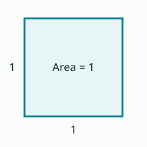

# Extended Markdown examples

This file can be previewed on its own. For complete rules, see the [syntax reference](../SYNTAX.md).

## Mathematics

Inline math: $e^{i\pi}+1=0$ and \(a^2+b^2=c^2\).

\[
\int_0^1 x^2\,\mathrm{d}x=\frac13
\]

$$
\begin{pmatrix}a & b \\ c & d\end{pmatrix}
$$

A forward reference: \(\eqref{eq:energy}\).

\begin{align}
E &= mc^2 \label{eq:energy} \\
p &= mv \notag
\end{align}

\[
\newcommand{\RR}{\mathbb{R}}
x\in\RR,\qquad\boldsymbol{\alpha},\qquad\norm{x}
\]

## Statements


The unit interval is $[0,1]$.



For $x\in\mathbb{R}$, $(x+1)^2=x^2+2x+1$.


Expand the product $(x+1)(x+1)$.




The square of a real number is nonnegative.



The sum of two nonnegative numbers is nonnegative.



For real $x,y$, $x^2+y^2\ge0$.



At $x=1$, the identity reads $4=1+2+1$.



Expand $(x-1)^2$.



The result is $x^2-2x+1$.



Body text, statement titles, and formulas can be combined. Labels remain in English.



Statement markers in code samples remain literal:

```markdown

$a^2+b^2=c^2$

```


## Highlights

Yellow text,
green **emphasis** and $x^2$,
pink text.

## Images



## References and footnotes

An example reference [@sample2026], a locator [@sample2026, p. 12],
and a group [@sample2026; @other2025]. A footnote can also cite a source[^detail].

[^detail]: Another citation [@other2025].


@book{sample2026,
  author = {Doe, Jane},
  title = {Sample Mathematical Notes},
  publisher = {Example Press},
  year = {2026},
  url = {https://example.com/notes}
}
@article{other2025,
  author = {Smith, Alex},
  title = {An Example Article},
  journal = {Example Journal},
  year = {2025}
}

